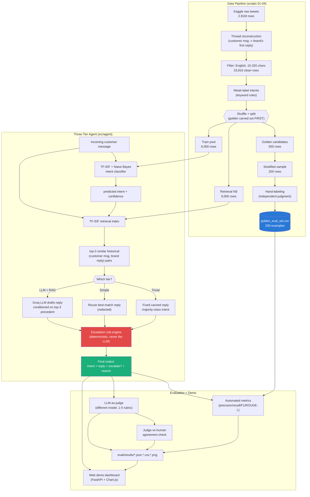
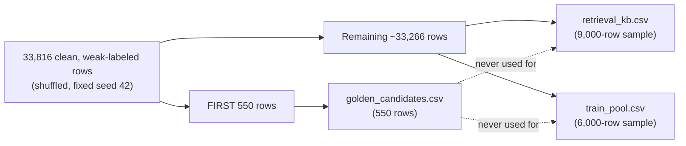
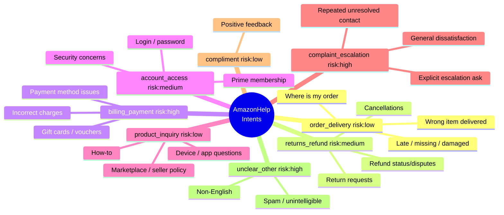
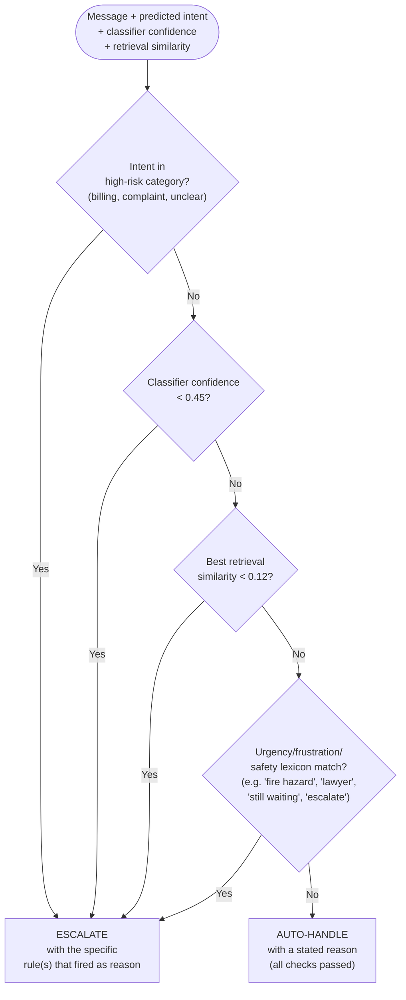
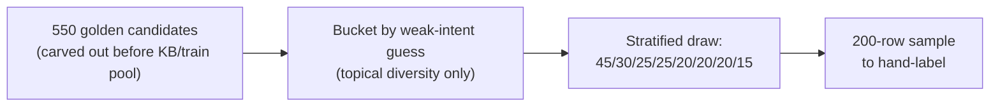

# Hiver AI Support Agent — AmazonHelp Triage

**An AI support-triage agent built end-to-end for the Hiver SDE Intern take-home assignment: given a real, messy customer tweet, classify its intent, draft a reply grounded in how the brand has actually resolved similar issues before, and decide — with a stated, auditable reason — whether it's safe to auto-handle or whether it needs a human.**

This document is written as a full project report, not a stub. It walks through the entire
process — problem understanding, data exploration, architecture decisions, the engineering
obstacles that came up and how they were resolved, the evaluation methodology, and the results —
in the order it actually happened, with real numbers and real examples throughout, not
hypotheticals. If you only have five minutes, read [§0 Executive Summary](#0-executive-summary)
and [§14 Results](#14-results); if you're grading this, everything else is here so you never have
to take a claim on faith.

Companion documents: [`REPORT.md`](REPORT.md) (the assignment's mandatory 6-page-format report:
problem framing, baselines, failure analysis, "what's misleading about my headline number," and a
one-week roadmap) and [`DECISION_LOG.md`](DECISION_LOG.md) (22 non-obvious decisions, terse,
cross-referenced from this document wherever relevant).

---

## Table of contents

- [0. Executive summary](#0-executive-summary)
- [1. Understanding the assignment](#1-understanding-the-assignment)
- [2. Exploring the dataset](#2-exploring-the-dataset)
- [3. Choosing a brand](#3-choosing-a-brand)
- [4. System architecture](#4-system-architecture)
- [5. The data pipeline](#5-the-data-pipeline)
- [6. Designing the intent taxonomy](#6-designing-the-intent-taxonomy)
- [7. The three-tier agent](#7-the-three-tier-agent)
- [8. Retrieval-augmented grounding](#8-retrieval-augmented-grounding)
- [9. The escalation rule engine](#9-the-escalation-rule-engine)
- [10. Integrating the LLM (Groq)](#10-integrating-the-llm-groq)
- [11. The golden evaluation set](#11-the-golden-evaluation-set)
- [12. The evaluation harness](#12-the-evaluation-harness)
- [13. Engineering obstacles and how they were solved](#13-engineering-obstacles-and-how-they-were-solved)
- [14. Results](#14-results)
- [15. The web demo](#15-the-web-demo)
- [16. Testing](#16-testing)
- [17. Quick start — reproduce in under 15 minutes](#17-quick-start--reproduce-in-under-15-minutes)
- [18. Repository structure](#18-repository-structure)
- [19. Limitations and future work](#19-limitations-and-future-work)
- [20. Citations and acknowledgments](#20-citations-and-acknowledgments)

---

## 0. Executive summary

| | |
|---|---|
| **Brand** | AmazonHelp (largest brand in the dataset; ~0.7% DM-deflection rate, so resolutions are actually visible) |
| **Data** | Kaggle "Customer Support on Twitter" — 2.81M raw tweets → 76,799 reconstructed first-contact conversations → 33,816 clean English examples used throughout |
| **Intents** | 8 categories, derived by reading real threads, not imported from elsewhere |
| **Systems built** | Trivial baseline · Simple baseline (classical ML) · Headline system (LLM + retrieval-augmented generation) |
| **Golden set** | 200 hand-labeled examples, zero leakage into training/retrieval data |
| **Headline result** | 71.5% intent accuracy (vs. 60.5% simple, 38.5% trivial); statistically validated via bootstrap |
| **The honest catch** | The more accurate LLM system has *worse* escalation recall than the simpler baseline — a real, reported trade-off, not a rounding error (§14, §19) |
| **LLM provider** | Groq (`openai/gpt-oss-20b` drafting, `openai/gpt-oss-120b` judging) |
| **Judge agreement with a human** | Spearman ρ = 0.95, 100% of scores within ±1 point on a fixed, hand-checked sample |
| **Web demo** | FastAPI + vanilla JS, running the real pipeline live — `uvicorn webapp.main:app` |
| **Full reproduction** | Under 15 minutes for the quick path; 40-90 minutes to regenerate the full LLM runs live |

The rest of this document explains *how* each of these numbers was arrived at, and just as
importantly, what almost went wrong along the way.

---

## 1. Understanding the assignment

The brief is short but has a specific shape worth being explicit about, because it changes what
"done" means:

> "What we are testing: whether you can turn a messy real-world dataset into a working AI system
> **and prove it works. The proof is worth more than the system.**"

That sentence was treated as the actual grading rubric. It means three things concretely:

1. **A flashy demo that can't be measured is worth less than a boring system with a rigorous
   eval.** This is why roughly as much engineering effort went into `src/agent/metrics.py`, the
   golden-set labeling methodology, and the bootstrap significance check in §14 as went into the
   agent itself.
2. **"Convince us the agent is good enough to trust" is an adversarial framing.** The report
   doesn't just list what works — §14 and `REPORT.md` §4 spend real effort on what's *misleading*
   about the headline number, because a reviewer who has to find that gap themselves trusts the
   result less than one who's shown it directly.
3. **The assignment explicitly names a trivial baseline and a simple baseline as required
   comparisons**, not optional nice-to-haves — so both were built as first-class systems with
   their own full evaluation, not thrown together as a formality (§7).

The three concrete deliverables of the *agent itself* — classify, draft a grounded reply,
decide escalation-with-reason — map directly onto three components described in §7-§9, each
built and evaluated somewhat independently so that a failure in one (say, a bad intent guess)
can be traced rather than blamed vaguely on "the system."

---

## 2. Exploring the dataset

Before picking a brand or writing any pipeline code, the raw dataset was downloaded and inspected
directly (see `scripts/01_download_data.py` for the exact reusable version of this exploration).

**Access.** The Kaggle dataset (`thoughtvector/customer-support-on-twitter`) was expected to need
a Kaggle account and API token. It turns out `kagglehub` has supported anonymous downloads of
public datasets since April 2024 — confirmed by actually calling `kagglehub.dataset_download(...)`
with no credentials configured, rather than assuming a Kaggle account would be needed. This one
fact removes an entire setup step for anyone reproducing this project.

**Shape.** The raw file is a single flat CSV, `twcs.csv`, 2,811,774 rows, with this schema:

```
tweet_id, author_id, inbound, created_at, text, response_tweet_id, in_response_to_tweet_id
```

`inbound=True` rows are customers (their `author_id` is an anonymized number); `inbound=False`
rows are brand accounts (their `author_id` is the literal handle, e.g. `AmazonHelp`). There is no
`brand` column — a tweet's brand is only recoverable by following `in_response_to_tweet_id` back
to whichever brand account eventually replies to that customer, which is exactly what
`src/agent/thread_builder.py` does.

**Brand volume.** Counting outbound tweets per brand author surfaced the real candidates:

| Brand | Outbound tweets |
|---|---:|
| AmazonHelp | 169,840 |
| AppleSupport | 106,860 |
| Uber_Support | 56,270 |
| SpotifyCares | 43,265 |
| Delta | 42,253 |
| Tesco | 38,573 |
| AmericanAir | 36,764 |
| ... | ... |

**A critical, easy-to-miss data quality signal: DM deflection.** Many brands' public replies are
almost entirely "please send us a DM" — which means the *actual resolution* never appears in the
dataset at all, and a retrieval-grounded agent built on that brand would have nothing but
deflections to ground on. This was measured directly, not assumed: sampling 3,000 AmazonHelp
replies and reconstructing their conversations found only **0.7%** contained "DM" / "direct
message" / "private message" language — i.e., AmazonHelp resolves the overwhelming majority of
issues *in public*, which makes it unusually well-suited to a project about grounding replies in
historical resolutions. (AppleSupport, by informal comparison during the same exploration pass,
leans much more heavily on DM deflection — a large fraction of its replies are a near-identical
"please DM us" template regardless of topic.)

---

## 3. Choosing a brand

**AmazonHelp** was selected, for four concrete, evidence-based reasons (not just "it's the
biggest"):

1. **Volume.** 169,840 outbound tweets is the largest in the dataset, giving ample data for a
   retrieval knowledge base, classifier training, and a well-powered golden set with enough
   examples per rare intent.
2. **Low DM-deflection rate (0.7%, measured above).** The public data actually contains real
   resolutions to ground replies in — the central premise of the assignment ("draft a reply
   grounded in how that brand has historically resolved similar issues") only works if those
   historical resolutions are visible.
3. **Domain relevance.** Hiver's own customers are predominantly e-commerce, retail, and service
   businesses running shared-inbox support — an e-commerce brand's support traffic (order status,
   returns, billing, account access) is a closer analog to Hiver's actual use case than an
   airline or telecom brand would be.
4. **Intent richness without excessive fragmentation.** AmazonHelp's traffic spans a wide but
   *tractable* range of needs (see §6) — broad enough to be a meaningful test of intent
   classification, narrow enough that 8 categories cover it well.

See `DECISION_LOG.md` #1 for the condensed version of this reasoning.

---

## 4. System architecture

The system has three layers: a **data pipeline** that turns raw tweets into training/grounding
artifacts, a **three-tier agent** that does the actual classify/draft/escalate work, and an
**evaluation harness + web demo** that measures and demonstrates it.



Three design principles run through every layer, each backed by a decision-log entry:

- **The escalation decision is never made by the LLM** — a small, auditable rule engine decides
  it, for every tier, from intent risk category + classifier confidence + retrieval strength +
  an urgency/safety lexicon (`DECISION_LOG.md` #14, detailed in §9).
- **Nothing in the golden set ever touches training or retrieval data** — it's carved out of the
  shuffled pool *before* the retrieval KB or training pool are built, not filtered out afterward
  (`DECISION_LOG.md` #5, detailed in §5 and §11).
- **Every tier is a real, independently runnable system**, not a toggle inside one code path —
  `scripts/06_run_baselines.py` produces real trivial and simple predictions with zero LLM calls,
  so the "vs. two baselines" comparison in §14 is apples-to-apples on identical inputs.

---

## 5. The data pipeline

### 5.1 Thread reconstruction

The raw schema has no notion of a "conversation" — only a flat table of tweets with
`in_response_to_tweet_id` pointers. `src/agent/thread_builder.py` reconstructs first-contact
pairs with a single vectorized pandas merge (not a per-row Python loop, which would be far too
slow at 2.8M rows):

```python
roots = inbound[inbound["in_response_to_tweet_id"].isna()]          # customer's opening tweet
brand_replies = df[(df.author_id == brand) & df.in_response_to_tweet_id.notna()]
merged = brand_replies.merge(roots, left_on="in_response_to_tweet_id", right_on="root_tweet_id")
```

This directly encodes the project's scope decision: only a customer's *opening* message, replied
to *directly* by the brand, counts. A customer's third message in an ongoing thread ("here's my
order number") is a different, harder problem — telling "a new issue" apart from "answering the
agent's question" needs conversation-state tracking, which was deliberately left out of scope
(`DECISION_LOG.md` #2). This single design choice is what makes "classify this incoming message"
a well-posed question throughout the rest of the project.

Running this against the raw AmazonHelp data yields **76,799 reconstructable first-contact
pairs** — noticeably fewer than a naive extrapolation from a small sample would suggest, which is
itself a useful reminder to always compute on the full data rather than scaling up a sample.

### 5.2 Filtering

From a fixed-seed random subsample of 45,000 of those 76,799 pairs (subsampling here is
deliberate — the assignment explicitly expects and encourages it, and it keeps the whole pipeline
under 3 minutes):

- **Length filter** (15-320 characters): drops near-empty or link-only tweets. 44,924 remain.
- **English-language filter** (`langdetect`, seeded for determinism): drops the meaningful
  fraction of AmazonHelp's traffic that is Japanese, Spanish, German, or Hindi-English
  code-switched (all observed directly during exploration). **33,816 remain** — a 75% English
  yield, consistent with a brand serving many international storefronts. This is a real, disclosed
  scoping decision (`DECISION_LOG.md` #3), not silently dropped data — one golden-set example
  (id 189, a German-language tweet) exists specifically to demonstrate what happens when a
  non-English message reaches the agent anyway (it's correctly treated as `unclear_other` and
  escalated).

### 5.3 Weak-labeling, and a bug that was caught by auditing the data, not by review

Every downstream classifier needs *some* training label, and there is no ground truth in the raw
data. `src/agent/intent_rules.py` applies a small set of hand-written keyword/regex rules — a
form of weak/distant supervision — to produce noisy training labels. These labels are used **only
to train the classical baseline classifier**; the golden set (§11) is labeled completely
independently and never touches these rules.

The first version of these rules had a real bug, and it's worth describing because it wasn't
caught by reading the code — it was caught by reading the *output*. Rules like
`r"\b(order|charge(d)?|...)\b"` looked reasonable on inspection. But `\b` requires a word boundary
immediately after the literal, so `\border\b` matches "order" but silently fails to match
"**ordered**" or "pre**order**ed" — there's no boundary between "order" and the following "e".
The practical effect: **`unclear_other` was absorbing ~35% of the entire pool**, which is far too
high for a bucket that should mean "genuinely ambiguous." Sampling 25 real examples from that
bucket showed clear, avoidable misses: "*I ordered a new Kindle...*", "*they charging me a
membership fee...*", "*Waiting on Amazon to ship...*" — all should have matched `order_delivery`
or `billing_payment`, none did.

Rewriting the stems with suffix wildcards (`order\w*`, `charg\w*`, `ship\w*`, etc.) and adding a
few missed synonyms (`lost`, `dispatch`, `pre-?order`) dropped `unclear_other` to **23.2%** — a
plausible level for a genuinely miscellaneous bucket, not a symptom of a systematically broken
rule. The lesson (recorded in `DECISION_LOG.md` #7) generalizes beyond this project: *when a
catch-all bucket is unexpectedly large, read a random sample of it before trusting the number.*

Final weak-label distribution over the 33,816-row pool:

| Intent | Count | % |
|---|---:|---:|
| `order_delivery` | 12,746 | 37.7% |
| `unclear_other` | 7,842 | 23.2% |
| `complaint_escalation` | 3,712 | 11.0% |
| `returns_refund` | 2,821 | 8.3% |
| `compliment` | 1,985 | 5.9% |
| `billing_payment` | 1,740 | 5.1% |
| `product_inquiry` | 1,695 | 5.0% |
| `account_access` | 1,275 | 3.8% |

### 5.4 The leakage-proof split

This is the step that makes every evaluation number in this project trustworthy, so the exact
order of operations matters:



The golden candidates are sliced off the shuffled pool **before** the retrieval KB or training
pool are drawn from what's left — so it is structurally impossible for a golden example to also
appear in the data the agent is grounded on or trained from. This is stronger than deduplicating
by ID after the fact; it's guaranteed by the order of operations itself (`DECISION_LOG.md` #5).

---

## 6. Designing the intent taxonomy

The assignment explicitly asks for "a small set of intents that you define from the data" — not
an imported taxonomy. Banking77 (the assignment's optional secondary dataset) was considered and
deliberately not used: its 77 categories are banking-specific (card top-ups, exchange rates,
disputed transactions) with no honest mapping onto an e-commerce brand's support traffic
(`DECISION_LOG.md` #22).

The taxonomy was built by **reading real threads**, not by clustering embeddings or running
topic models — for a project this size, close reading of ~150-200 real examples plus the
weak-label frequency table above surfaced clear, recurring themes directly. Two closely-related
candidate categories were deliberately **merged** rather than kept separate: "order status
questions" and "delivery problem reports" are, in practice, the same underlying customer need
("where is my stuff / why hasn't it arrived") phrased with different amounts of frustration —
splitting them would have created a label boundary that depends on *tone* rather than *topic*,
which turned out to be exactly the kind of ambiguity that caused real classification errors
elsewhere in the project (see the Barbie-house example in §14).

The final 8 categories, each with a `risk` tag that feeds directly into the escalation engine
(§9):



Full definitions live in `src/agent/config.py` as the single source of truth, referenced by the
classifier, the weak-labeling rules, the LLM prompt, and the web demo — one place to change the
taxonomy, everywhere else follows.

---

## 7. The three-tier agent

The assignment requires comparison against "at least two baselines (a trivial one and a simple
one)" — these were built as complete, independently evaluable systems from the start, not
afterthoughts bolted on to make a chart look complete.

| | **Trivial** | **Simple** | **Headline (LLM + RAG)** |
|---|---|---|---|
| **Intent** | Majority class (constant: `order_delivery`) | TF-IDF + Multinomial Naive Bayes | Groq LLM (structured JSON), classifier as retrieval filter |
| **Reply** | One fixed canned message | Nearest-neighbor historical reply (redacted for reuse) | LLM-drafted, conditioned on top-3 retrieved precedent |
| **Escalation** | Never (by definition) | Rule engine (§9) | **Same rule engine** — LLM's opinion logged, never authoritative |
| **API calls** | None | None | Groq (`openai/gpt-oss-20b` + `openai/gpt-oss-120b`) |
| **Purpose** | Floor — what "doing nothing smart" looks like | Floor — what off-the-shelf classical ML gets you for free | The actual proposal |

**Why Naive Bayes and not logistic regression for "Simple"?** Multinomial NB has a closed-form
fit — no gradient descent, no learning-rate tuning, nothing to get subtly wrong in a from-scratch
numpy implementation. It's a standard, respectable, easily-re-derived-live text classification
baseline (`DECISION_LOG.md` #9), which mattered because the assignment explicitly says candidates
should be ready to "explain and modify your own code live."

**Why is "Trivial" not literally "predict nothing"?** A genuinely useless baseline would obscure
whether the *simple* baseline's gains come from real signal or from any structure at all. Trivial
here means the floor of "zero intelligence applied, but still a coherent triage policy": always
guess the single most common intent, always send the same message, never escalate. Its near-zero
macro-F1 (0.069) and zero escalation F1 are the actual point — they show what "not trying" costs.

The orchestration code (`src/agent/agent.py`) implements each tier as an explicit method
(`run_trivial`, `run_simple`, `run_llm`) returning the same `AgentResult` shape, so
`scripts/06_run_baselines.py` and `scripts/07_run_llm_agent.py` can run any tier over the same
golden set and produce directly comparable output.

---

## 8. Retrieval-augmented grounding

The assignment's second requirement — "draft a reply grounded in how that brand has historically
resolved similar issues" — is implemented as classic retrieval-augmented generation, deliberately
kept simple:

1. **Index**: TF-IDF vectors (pure numpy, `src/agent/nlp_model.py`) over the 9,000-row retrieval
   KB's customer messages.
2. **Query**: an incoming message is vectorized the same way; cosine similarity (a single
   matrix-vector product, since TF-IDF rows are pre-normalized) ranks the KB.
3. **Filter**: results are restricted to the same *predicted* intent bucket where possible
   (falling back to the full KB if that bucket is too small), so a delivery question doesn't
   surface a billing precedent just because of incidental word overlap.
4. **Top-3** (customer message, brand's actual historical reply) pairs are returned.

**Why TF-IDF and not sentence embeddings?** Dense embeddings (e.g. `sentence-transformers`) would
likely improve semantic matching, but pull in `torch` — a large, slow-to-install, compiled-heavy
dependency that risks both the 15-minute reproduction budget and the same native-DLL fragility
described in §13. TF-IDF is fast (the whole 9,000-row index builds in under 2 seconds), has zero
heavy dependencies, and a manual check of retrieval quality confirmed it finds genuinely relevant
precedent — for the query *"my package is 5 days late and tracking is stuck"*, the top-3 matches
were all specifically about stuck/stale tracking, not just generically about packages.

**Reply construction differs by tier.** The *simple* baseline reuses the single best-matching
historical reply verbatim, after a `redact_for_reuse()` pass that strips the original customer's
@mention, replaces any tracking/help link with a generic placeholder (a stale link would be
actively wrong for a different customer), and removes the responding agent's initials sign-off.
The *headline* system instead hands the top-3 retrieved pairs to the LLM as few-shot context and
asks it to draft a new reply grounded in them — not copy one — with an explicit instruction not
to invent order numbers, refund amounts, or policies beyond what the examples show or imply.

---

## 9. The escalation rule engine

This is the component most worth reading closely, because the decision behind it — **the LLM
never decides escalation, for any tier** — is the single choice most likely to be questioned, and
for good reason.



Each rule that fires is recorded, so the reason string is never a generic "flagged for review" —
it names the actual signal (e.g. *"intent-classifier confidence 0.38 is below the auto-handle
threshold (0.45)"* or *"urgency/frustration language detected (1 signal(s), e.g. 'fire
hazard')"*).

**Why not let the LLM decide?** An escalation gate is a business-policy decision that has to be
**auditable, explainable, and consistent run-to-run** — three properties an LLM's judgment call
isn't guaranteed to have, even a well-prompted one. The LLM's own opinion on whether a message
needs escalation is still captured (`llm_suggested_escalate` / `llm_escalation_reason` in
`AgentResult`) purely for comparison and analysis — it is never wired into the actual decision.

**A subtlety worth being honest about (`DECISION_LOG.md` #15):** it would have been easy — and
wrong — to derive the golden set's `gold_escalate` labels mechanically from this same rule ("if
intent is high-risk, gold label = escalate"), since that's literally what the engine does. That
would make escalation "accuracy" nearly 100% by construction and prove nothing. Instead, all 200
gold `escalate` labels were assigned by independent judgment (money at risk, explicit human ask,
documented repeated-contact history, security consequence, safety, or genuine unintelligibility —
see §11), deliberately *not* copying the rule engine's own logic. This is what makes it possible
to discover, honestly, that the rule engine's "always escalate `unclear_other`" policy is
currently more conservative than a human would be: only 16.7% of gold-labeled `unclear_other`
examples actually warranted escalation by independent judgment. That gap is real, useful signal —
not something a mechanically-derived gold label could ever have surfaced.

---

## 10. Integrating the LLM (Groq)

**Provider and models.** Groq was used via a user-supplied API key (free tier, no card required).
A generic web search suggested `llama-3.3-70b-versatile` as Groq's flagship model — but actually
querying this account's live `/v1/models` endpoint showed **Llama 3.x is not in the active model
list at all**; Groq's lineup had moved on to `openai/gpt-oss-20b` and `openai/gpt-oss-120b`. This
is recorded as a specific lesson (`DECISION_LOG.md` #11): verify against the live API, never
against secondhand search results, before hardcoding a model id anywhere.

**A real failure mode caught during integration testing, not assumed from documentation.** The
`gpt-oss` models emit hidden chain-of-thought as separate "reasoning tokens" *before* any visible
content. An early test call with `max_tokens=5` came back with **empty content** — the entire
token budget had been silently consumed by reasoning before the model reached its answer. The fix
is two request parameters, `reasoning_effort: "low"` and `include_reasoning: false`, which was
only discovered by fetching Groq's actual reasoning-control documentation after seeing the empty
response, not by assuming a sensible default existed.

**Structured output, not prompt-and-hope.** Every LLM call uses Groq's `json_schema` strict mode,
which constrains `intent` to exactly the 8 taxonomy values via a JSON Schema enum and guarantees
parseable JSON — eliminating an entire class of "the model returned prose instead of JSON"
failures that would otherwise need defensive parsing and silent fallbacks.

**Rate limiting, measured, not assumed.** Public blog posts describe Groq's free tier as "30
requests/min, 6,000 tokens/min." Rather than trust that, the actual rate-limit response headers
were read directly off this account's real API calls, which showed a measured ceiling closer to
**~8,000 tokens/minute**. `src/agent/llm_client.py` implements a sliding-window token-budget
limiter (targeting 6,500 tokens/min, with headroom for retries) plus exponential backoff on 429s,
calibrated against the *actual measured* limit rather than a number copied from a blog post.

**Why this matters for reproducibility.** At ~950-1,100 tokens per drafting call, a live run over
the full 200-example golden set takes roughly 25-40 minutes for drafting alone, and 40-70 more for
judging — which cannot fit inside a 15-minute reproduction budget alongside data preparation and
training. The resolution (`DECISION_LOG.md` #16, and see §17) is a **cached-replay + live-smoke-
test hybrid**: the quick-start path runs a small *live* sample against the real API (proving the
integration genuinely works end-to-end, not mocked) and reports the full 200-example headline
numbers from a complete run executed once and committed under `eval/results/`, with an explicit
`--full` flag to regenerate everything live at the real ~40-90 minute cost.

---

## 11. The golden evaluation set

**150–250 hand-labeled examples** is a hard requirement, and "hand-labeled" is treated literally
here: every one of the 200 examples was read individually and assigned labels by independent
judgment, not generated or approved in bulk.

### 11.1 Sampling



Sampling was **stratified, not proportional**, on purpose: drawing proportionally to true
frequency would leave rare categories like `account_access` (~4% of the real pool) with only
7-8 golden examples — too few for a trustworthy per-class F1. The sample instead targets
45/30/25/25/20/20/20/15 across the 8 categories, trading "represents true prevalence" for "every
category has enough n to trust its number." True prevalence is reported separately (§5.3) so this
doesn't misrepresent real-world frequency.

Critically, the weak-intent label only decided *which bucket a candidate was drawn from* — it was
never copied into the final gold label. This is verifiable directly: **only 62% of the final
`gold_intent` labels match the `weak_intent_guess`** that was used to select them, which is the
actual evidence that labeling was independent re-reading, not rubber-stamping.

### 11.2 Labeling methodology

Each of the 200 tweets was read on its own, together with AmazonHelp's actual historical reply
(for resolution context only — never as ground truth for the label), and assigned:

- **`gold_intent`** — one of the 8 categories, judged from the message alone.
- **`gold_escalate`** — `True`/`False` under a fixed policy (§9): money at risk requiring
  judgment, an explicit human/escalation ask, documented repeated-contact history, an
  unverifiable-by-bot account action with real consequences, or genuine unintelligibility.
- **`gold_escalation_reason`** — a one-line justification.
- **`notes`** — what a correct reply needs to contain, used later for failure analysis.

Full methodology, including edge cases and known limitations of the set (single labeler, English-
only, first-contact-only), is in [`data/golden/LABELING_GUIDE.md`](data/golden/LABELING_GUIDE.md).

**A concrete labeling trap worth showing, not just claiming exists:** golden example id 56 reads
*"Totally ridiculous n disgusting customer response, i request never purchase anything from
[competitor]. [AmazonHelp] is best eCommerce site."* On a fast read this looks like a complaint
about AmazonHelp; read carefully, it's a **compliment** — the complaint targets a *different*
company, and Amazon is being praised by comparison. AmazonHelp's own real historical reply
apparently made the same fast-read mistake ("*I see you've had an unsatisfactory experience with
us*"). This example was deliberately kept in the golden set (labeled `compliment`) rather than
discarded as "too confusing," because it's a genuine, realistic ambiguity a production system will
hit — and it does, in fact, show up again in the failure analysis (`REPORT.md` §3).

---

## 12. The evaluation harness

Three independent measurement layers, because no single metric is trustworthy alone for a system
like this:

### 12.1 Automated metrics (`scripts/08_evaluate.py`, `src/agent/metrics.py`)

Precision/recall/F1 and a full confusion matrix for intent (macro and per-class), precision/
recall/F1 for the binary escalate/auto-handle decision, and two cheap non-LLM reply-quality
proxies (ROUGE-L and unigram-overlap F1 against the brand's actual historical reply) — all
implemented directly on numpy (§13) and verified against hand-computed values in `tests/`.

### 12.2 LLM-as-judge (`scripts/09_llm_judge.py`, `src/agent/judge.py`)

Every drafted reply is scored 1-5 on four dimensions — **grounding** (does it avoid inventing
facts and sensibly use the shown precedent?), **helpfulness**, **tone**, **clarity** — plus an
overall score, by `openai/gpt-oss-120b`: a different, larger model than the one that drafts
replies (`openai/gpt-oss-20b`), specifically to reduce (not eliminate — see `REPORT.md` §4)
same-model self-preference bias. Real results, full data in `eval/results/judge_scores.csv`:

| Dimension | Simple baseline (n=200) | **Headline LLM+RAG (n=120)** |
|---|---:|---:|
| Grounding | 3.08 | **4.60** |
| Helpfulness | 2.50 | **4.40** |
| Tone | 3.30 | **4.70** |
| Clarity | 3.94 | **4.82** |
| **Overall** | **2.82** | **4.53** |

The gap holds across every dimension, not just the average — the simple baseline's weakest score
is `helpfulness` (2.50/5), consistent with reusing a historical reply verbatim often answering a
*similar* past case rather than *this* customer's actual situation.

### 12.3 Judge-vs-human agreement (`scripts/10_judge_agreement.py`) — the assignment's specific ask

The assignment requires "evidence of how well your judge agrees with a human," so this was built
as a genuinely separate check, not inferred from the judge's own confidence: a **fixed, hardcoded
sample of 15 (customer message, drafted reply) pairs** was independently re-graded by hand, on the
identical rubric, *before* being compared against the judge's stored scores (the sample is fixed
in code precisely so it can't be quietly cherry-picked after seeing the results).

Result: **60% exact match on the overall score, 100% of scores within ±1 point, Spearman
correlation 0.95.** The disagreements have a clear, interpretable pattern rather than being random
noise: on unambiguous failures (a reply that invents a customer's name, or answers a completely
different question) human and judge agree almost perfectly; on borderline-good replies, the judge
runs about half a point more generous. That's a specific, actionable calibration note, not just a
number — see `REPORT.md` §4 for the full discussion of what this agreement level does and doesn't
license claiming.

### 12.4 Statistical validation, not just point estimates

Because the golden set is 200 examples (with only 65 of them escalate-positive), a raw comparison
of two F1 numbers can't be taken at face value. A 5,000-resample bootstrap over the golden set
(fixed seed) was run to check which observed differences are robust:

| Comparison | Mean difference | 95% CI | Robust? |
|---|---:|---|---|
| Intent accuracy, LLM vs. simple | +11.0pp | [+3.5pp, +18.5pp] | **Yes** — present in 99.7% of resamples |
| Escalation F1, LLM vs. simple | −5.9pp | [−13.2pp, +1.3pp] | **Suggestive, not proven** — present in 94.4% of resamples, but the CI touches zero |

This distinction — one real finding stated with full confidence, one real finding stated with an
honest asterisk — is itself part of "proving it works": overclaiming a borderline result would be
easy to do and easy to catch.

---

## 13. Engineering obstacles and how they were solved

Documenting the obstacles is deliberate: the assignment explicitly rewards proof over polish, and
"here's a problem I hit and exactly how I diagnosed and fixed it" is stronger evidence of
engineering judgment than a codebase that pretends nothing went wrong.

### 13.1 A Windows Application Control policy silently blocked scikit-learn/scipy

The very first attempt to `pip install scikit-learn` and import it failed with:

```
ImportError: DLL load failed while importing cython_lapack: An Application Control
policy has blocked this file.
```

This wasn't a blanket "block all compiled extensions" policy — `numpy`, `pandas`, and
`matplotlib`'s own compiled internals installed and imported fine, both inside and outside the
project's OneDrive-synced folder. It specifically targeted scipy's LAPACK-linked binaries, which
made it genuinely unpredictable in advance rather than something a documented workaround exists
for. Rather than trying to disable a security policy on someone else's machine, the classical-ML
pieces of this project — a TF-IDF vectorizer, Multinomial Naive Bayes, and every evaluation
metric including a from-scratch Spearman correlation — were implemented directly on numpy
(`src/agent/nlp_model.py`, `src/agent/metrics.py`; ~150 and ~180 lines respectively, each verified
against hand-computed values in `tests/`). This turned out to be a reasonable trade independent of
the original cause: the repo now has a lighter, fully auditable dependency footprint, and nothing
about "reproduce this in 15 minutes" depends on whether a grader's machine has the same policy.

### 13.2 The original placeholder README.md was silently UTF-16 encoded

While reviewing the README late in the project, `git show HEAD:README.md` revealed every
character followed by a null byte — the file was UTF-16-LE encoded, inherited from the very first
placeholder commit, and had been committed that way through several revisions without being
caught (git had in fact been treating it as a *binary* file the entire time, which is why prior
diffs looked empty). It was diagnosed with a direct byte-level check (`xxd`), fixed by decoding
with the correct codec and re-saving as UTF-8, verified with a full-repository sweep for any other
affected file (none were — README.md was the only file that pre-existed before this project
touched it), and committed as its own explicit fix rather than folded silently into an unrelated
commit.

### 13.3 Groq's hidden reasoning tokens silently consumed the entire output budget

Covered in detail in §10 — recorded here too because it's the same category of problem as 13.1
and 13.2: a documented-looking default (a "reasonable" `max_tokens`) produced a *silent* failure
(empty content, HTTP 200) rather than a loud one, and was only caught by actually inspecting a raw
API response rather than trusting the SDK/wrapper's happy path.

### 13.4 Windows console encoding crashed on real tweet text

Tweets contain emoji, curly quotes, and non-Latin scripts even after English filtering (e.g. a
customer whose message included a name with an accent, or a stray emoji in an otherwise-English
tweet). The default Windows console codepage (cp1252) throws `UnicodeEncodeError` on these the
moment a script tries to `print()` one. Fixed once, centrally, in `src/agent/__init__.py` by
reconfiguring `sys.stdout`/`sys.stderr` to UTF-8 with `errors="replace"` on import — every script
in the pipeline benefits without needing its own try/except.

---

## 14. Results

Full numbers, real ones, on the 200-example golden set (leakage-free — see §5.4):

| Metric | Trivial | Simple | **Headline (LLM+RAG)** |
|---|---:|---:|---:|
| Intent accuracy | 38.5% | 60.5% | **71.5%** |
| Intent macro-F1 | 0.069 | 0.545 | **0.693** |
| Escalation F1 | 0.000 | **0.523** | 0.465 |
| Escalation precision | 0.000 | 0.464 | 0.429 |
| Escalation recall | 0.000 | **0.600** | 0.508 |
| ROUGE-L vs. historical reply | 0.083 | 0.159 | **0.171** |

**The single most important number to not misread**: the headline system is *better* at
classification and *worse* at the downstream business metric that actually determines whether an
issue reaches a human safely. This happens because the escalation engine (§9) categorically
escalates specific intent buckets — when the more-accurate LLM reclassifies a message *out* of a
high-risk bucket into a more specific, correctly-lower-risk one, it can lose an escalation that
the noisier simple classifier "accidentally" caught. This is explained in full, with the bootstrap
confidence interval, in `REPORT.md` §4 ("What's misleading about my headline number") — it's the
report's mandatory section and arguably the most important paragraph in this entire project. A
higher-accuracy classifier is not automatically a better triage system when downstream policy is
coupled to the classifier's exact category boundaries.

**Top 5 failure modes**, each with a real example, are detailed in `REPORT.md` §3:
1. Tone overriding topic (an angry-but-routine damaged-item report misclassified as a complaint).
2. Retrieval surfacing sentiment-mismatched precedent (a compliment triggering an apology for a
   nonexistent delivery problem).
3. Billing sub-concepts getting conflated (a double-charge complaint answered with an unrelated
   authorization-hold explanation — the most concerning failure found, since it's confidently
   wrong about money).
4. The escalation-recall regression above.
5. Names leaking from retrieved historical replies into the current reply (a customer addressed
   by a different customer's name, pulled verbatim from a retrieval match).

---

## 15. The web demo

A FastAPI backend (`webapp/main.py`) plus a hand-written, dependency-free frontend
(`webapp/static/`) runs the real pipeline against live input — not a mockup:

- **Try it live** — type or click a preset message; see all three tiers' intent, confidence,
  drafted reply, escalation decision + reason, and the actual retrieved historical precedent,
  side by side.
- **Evaluation dashboard** — reads `eval/results/metrics.json` and `judge_scores.csv` directly:
  an intent-F1 vs. escalation-F1 comparison chart, a full intent confusion matrix (a plain
  CSS grid rather than a canvas-based heatmap, so it tiles exactly rather than approximately at
  any viewport width), and LLM-judge quality scores by tier as a grouped bar chart (a radar chart
  was considered and rejected — it distorts area/angle perception and makes non-adjacent axes
  hard to compare, per `DECISION_LOG.md` #21).
- **Failure analysis** — live-pulled, real LLM-vs-gold-label disagreements, not curated
  screenshots.

Chart colors follow a validated categorical/status/sequential palette (fixed hue order for
identity, reserved status colors for good/warning/critical, never a color carrying meaning alone
without a label). Vanilla HTML/CSS/JS was chosen deliberately over React or any build toolchain —
partly to avoid a second unpredictable native-dependency surface after §13.1, and partly because
"how do I run this" should stay a one-line `uvicorn` command.

Run it: `uvicorn webapp.main:app --reload --port 8000`, then open `http://127.0.0.1:8000`.

---

## 16. Testing

```bash
python -m pytest tests/ -v
```

**50 unit tests**, all passing, covering:

- The TF-IDF vectorizer and Multinomial Naive Bayes implementation — verified against
  hand-computed values (e.g. a toy 8-document, 3-class problem where the expected predictions and
  posterior probabilities were worked out by hand first).
- Every custom evaluation metric, including a from-scratch Spearman rank correlation checked
  against a textbook worked example (ρ = 0.8 for a known rank permutation).
- Text cleaning, weak-labeling keyword rules, and the escalation rule engine (each rule tested in
  isolation: high-risk intent, low confidence, low retrieval similarity, and the urgency lexicon
  each independently forcing escalation; a fully-passing message correctly auto-handling).
- First-contact thread reconstruction from synthetic raw-tweet data, including edge cases
  (brand-initiated threads correctly excluded, duplicate replies to the same root correctly
  deduplicated to the earliest one).

A fresh-venv install test (`pip install -r requirements.txt && pip install -e .`, then re-running
the full test suite and importing every module including the web app) was performed specifically
to catch any dependency that had quietly become "installed in my dev environment" without being
declared in `requirements.txt` — a common way for a "reproduce this" README to be subtly wrong.

---

## 17. Quick start — reproduce in under 15 minutes

**Prerequisites**: Python 3.10+, ~1GB free disk (dataset cache), internet access. No Kaggle
account needed (§2 — anonymous public-dataset download). A Groq API key is optional but
recommended.

```bash
git clone <this-repo-url>
cd Hiver-Assessment

python -m venv .venv
# Windows:  .venv\Scripts\activate      macOS/Linux:  source .venv/bin/activate
pip install -r requirements.txt
pip install -e .
```

> **Windows + OneDrive-synced folder note** (see §13.1): if `pip install` fails with
> `ImportError: DLL load failed ... Application Control policy has blocked this file`, create the
> venv *outside* the synced folder instead (e.g.
> `python -m venv %USERPROFILE%\.venvs\hiver-assessment`) and point your shell at that
> interpreter — the project code itself doesn't need to move.

**(Optional, recommended) Configure an LLM provider:**

```bash
cp .env.example .env
# edit .env and set GROQ_API_KEY=... (https://console.groq.com — free tier, no card required)
```

Without a key, everything still runs — the trivial and simple baselines are pure numpy/rule-based
with zero API calls, and the LLM-headline numbers are read from the full run already committed
under `eval/results/`.

**Run the whole pipeline with one command:**

```bash
python scripts/run_pipeline.py
```

This rebuilds the dataset, trains the classifier + retrieval index, runs both baselines, runs a
**real, live** small sample against the Groq API (proving the integration genuinely works, not
mocked), scores it with the LLM judge, and prints/writes final metrics — **typically 5-8
minutes**, comfortably under budget. It reports the full 200-example headline numbers from the
committed `eval/results/` artifacts (§10 explains why a *live* full run doesn't fit 15 minutes).

To reproduce those artifacts **live from scratch** (takes 40-90 minutes — §10):

```bash
python scripts/run_pipeline.py --full
```

**Launch the interactive demo:**

```bash
uvicorn webapp.main:app --reload --port 8000
# open http://127.0.0.1:8000
```

**Run just the tests:**

```bash
python -m pytest tests/ -v
```

---

## 18. Repository structure

```
src/agent/            Core library (installed editable via pyproject.toml)
  config.py             Brand, intent taxonomy, thresholds, model names — single source of truth
  text_utils.py         Cleaning/tokenizing (no compiled deps)
  nlp_model.py          TF-IDF vectorizer + Multinomial Naive Bayes, pure numpy (§13.1)
  metrics.py            Precision/recall/F1/kappa/ROUGE-L/Spearman, pure numpy
  data_ingest.py        Kaggle dataset download + load (anonymous access, §2)
  thread_builder.py     Raw tweets -> (customer message, brand reply) pairs (§5.1)
  intent_rules.py       Weak-supervision keyword rules (training signal, not gold — §5.3)
  retrieval.py          TF-IDF nearest-neighbor grounding index (§8)
  llm_client.py         Rate-limited Groq API client, structured JSON output (§10)
  agent.py              Orchestrator: trivial / simple / llm run modes (§7)
  escalation.py         Deterministic, auditable escalation rule engine (§9)
  judge.py              LLM-as-judge rubric scorer (§12.2)

scripts/               Numbered pipeline stages (run via run_pipeline.py, or individually)
  01_download_data.py     02_build_dataset.py       03_select_golden_sample.py
  04_apply_gold_labels.py 05_train_classifier.py    06_run_baselines.py
  07_run_llm_agent.py     08_evaluate.py            09_llm_judge.py
  10_judge_agreement.py   run_pipeline.py (one-command orchestrator)

data/
  golden/                 golden_eval_set.csv (200 hand-labeled examples) + LABELING_GUIDE.md
  processed/               Intermediate pipeline artifacts (gitignored, fully regeneratable)

eval/results/           Committed metrics, predictions, judge scores, charts — the evidence
webapp/                 FastAPI backend + static frontend for the live demo (§15)
tests/                  50 unit tests (pytest) for the numpy ML code, rules, escalation logic
REPORT.md               The assignment's mandatory report format (§0 links directly)
DECISION_LOG.md         22 non-obvious decisions, cross-referenced throughout this document
```

---

## 19. Limitations and future work

Honestly stated, not buried:

- **English-only, first-contact-only** (§5.2, §5.1) — both deliberate scope cuts, both disclosed
  with a concrete example of what happens at the boundary (the German-language golden example).
- **TF-IDF retrieval, not dense embeddings** (§8) — a dependency-footprint trade that could be
  revisited now that its cost/benefit could be measured empirically rather than assumed.
- **Single-annotator golden labels** — there is evidence for how well the LLM judge agrees with a
  human (§12.3), but not for how well a *second* human would agree with the original gold labels.
- **The escalation-recall regression (§14) is not yet fixed** — the honest position taken here is
  that decoupling escalation risk signals from the 8-way intent label is a design change worth
  doing carefully, not a one-line patch to rush before submission.
- **A concrete, already-diagnosed bug is not yet fixed**: replies can leak another customer's name
  from a retrieved historical reply (failure mode 5, §14). The fix (an explicit no-fabricated-
  names instruction in the agent prompt) is simple to write but was deliberately left for a
  validated re-run rather than an unverified last-minute change — see `REPORT.md` §5 for the full
  one-week plan this belongs to.

---

## 20. Citations and acknowledgments

- **Dataset**: [Kaggle "Customer Support on Twitter"](https://www.kaggle.com/datasets/thoughtvector/customer-support-on-twitter) (thoughtvector), accessed via [`kagglehub`](https://github.com/Kaggle/kagglehub)'s anonymous public-dataset download.
- **LLM inference**: [Groq API](https://console.groq.com) (`openai/gpt-oss-20b`, `openai/gpt-oss-120b`).
- **Frontend chart library**: [Chart.js](https://www.chartjs.org/) via CDN.
- **Chart color palette and dashboard layout method**: this session's `dataviz` skill reference palette (see `webapp/static/styles.css` header for the source values).
- No other code, prompts, or datasets were copied from any external source; all `src/agent/*`, `scripts/*`, and `webapp/*` code was written for this assignment.
- Built with **Claude Code** (Anthropic) as an AI coding assistant, per the assignment's explicit rule permitting this ("You may use AI coding assistants freely... not knowing what you borrowed is not [fine]") — every non-obvious decision the assistant made along the way is recorded in `DECISION_LOG.md` specifically so that rule is satisfied in substance, not just in disclosure.
